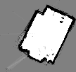

# bebop-eece5550
This repository itself will be treated as a ROS package. It will contain one or more nodes that are intended to be run on the turtlebot itself, and it will contain one or more nodes that will be run on the remote PC. The same package will be cloned to both machines for convenience. We will probably create two separate launch files, one that will be run on the robot and one that will be run on the remote PC.

To connect to the robot:
 - Make sure your machine and the robot are connected to the same network. If this is done, skip to the final bullet point.
 - Connect a display to the robot's HDMI port, connect a keyboard to a USB port, and power it on by flipping the switch on the OpenCR board. After logging in (username `ubuntu`, password `turtlebot`), the IP address should be printed to the screen with a bunch of other information. You can also check with the command `ifconfig`. 
 - If no IP prints, it is not connected to a network. You must edit the netplan file with the command `sudo nano ~/../../etc/netplan/50-cloud-init.yaml`. At the bottom of the file, the final two lines follow the format `WIFI_SSID:` and `password: WIFI_PASSWORD`. Replace the SSID and password with those for the network you plan to use. Save and exit the editor, then restart the robot with the command `sudo shutdown now`; after the green light on the raspberry pi stays off, flip the power switch off and back on to restart the pi. It should connect to the new network when it turns on, as long as the network is available.
 - The command `sudo netplan apply` is a good way to diagnose errors in the netplan file.
 - Once the robot and your computer are connected to the same network, you can connect to it with ssh, and the display/keyboard are no longer necessary for the robot. On linux, you can connect with the command `ssh ubuntu@IP_ADDRESS`, using the IP of the robot. On windows, you can connect by installing the application PuTTY. 

## Question 1: Steps to generate a PGM and YAML file of the mapped region
### Starting Recording 
* Connect turtlebot3 and Host Computer to same WiFi network
* SSH into the Raspi: `ssh ubuntu@192.168.___.___` 
* New MASTER terminal: `roscore`
* New MASTER terminal: `roslaunch turtlebot3_teleop turtlebot3_teleop_key.launch`
* Initiate sensors in HOST terminal: `roslaunch turtlebot3_bringup turtlebot3_robot.launch`
* New MASTER terminal: `cd /<Bag File Destination>`
  * Start Bag file recording: `rosbag record -a`
* New MASTER Terminal:
  * Start Cartographer Node: `roslaunch turtlebot3_slam turtlebot3_slam.launch slam_methods:=cartographer`
### Stopping recording of map:
  * Stop Bag file recorder: `Ctrl+C`
    * Bag file is created in the working directory of the recorder terminal
    * Name of bag file: _`YYYY-MM-DD-Time.bag`_ 
  * Finish Trajectory and write as a pbstream file
    * `rosservice call /finish_trajectory 0`
    * `rosservice call /write_state "{filename: '<Destination path>/<Filename>.pbstream', include_unfinished_submaps: "false"}" `
  * Stop cartographer node on MASTER
  * Using asset_writer service to obtain PGM and YAML files
    * Navigate to file directory for pbstream and bag files 
    * `roslaunch cartographer_ros assets_writer_ros_map.launch bag_filenames:=<Bag File Path>.bag pose_graph_filename:=<pbstream File poath>.pbstream`

### Viewing recorded data
  * Check pbstream file data:
    * `roslaunch cartographer_ros visualize_pbstream.launch pbstream_filename:=<pbstream File Path>/<Filename>.pbstream`
  * Play Rosbag file: `rosbag play <FilePath>.bag`
  * Visualize created map in Rviz
    * `rosrun rviz rviz`
    * `rosrun map_server map_server <YAML File Path>/<filename>.bag_map.yaml`
    
  The image here is a mapping of NEU's Colab 130P in the Snell Library
 

## Potential Issues
In Abhinav's computer, python2 and python3 both were installed
But in case of final installation sometimes by default python2 is used.
In such a case
* `sudo apt install python-is-python3`
* `alias python=python3`

Saving to a pbstream file had some issues. The exact command used:

* `rosservice call /write_state "{filename: '${HOME}/Desktop/NEU/EECE_5550/ROS_ASSIGNMENTS/LAB3_Setup/revo_lds.pbstream', include_unfinished_submaps: "false"}"`
It may sometimes be better to work by navigating to the directory and directly putting the file name than the path name.

## Final Assignment

### Background
In this project we apply the concepts of mobile robotics to perform autonomous reconnaissance in a simulated disaster environment. More specifically, our task entails placing a TurtleBot3 in an unexplored environment populated by AprilTags, which act as stand-ins for the simulated victims. The Turtlebot must generate a complete map of the environment in addition to a comprehensive list of the AprilTags present. This list must include the AprilTag's absolute pose with respect to the map generated and its ID number. To complete this task, the Turtlebot is equipped with a $360\degree$ LiDAR scanner, necessary for localization and mapping, and a Rasberry Pi Camera to detect the Apriltags. A successful reconnaissance operation will require our team to implement techniques such as mobile robotic kinematics and sensing, feature extraction, simultaneous localization and mapping (SLAM), and motion planning.

### Procedure
* Place the robot in a new, unknown, environment.
* Simultaneously:
  * Via Cartographer, perform SLAM to create a map of the environment and track the position of the robot.
  * Use frontier exploration to autonomously drive the robot around the environment.
  * Detect AprilTags and store their global poses.
* End the search after all the tags are detected and a complete map of the environment is developed

### To run our Code

1. Establish an SSH connection between the robot and the host PC. This can be done with the following command in the terminal:
    * `ssh ubuntu@IP_ADDRESS_OF_RASPI_ON_ROBOT`
- Update the `.bashrc` with the IP addresses of both devices. On the robot, the following two lines should be in the `.bashrc`
    * `export ROS_MASTER_URI=http://IP_ADDRESS_OF_REMOTE_PC:11311`
    * `export ROS_HOSTNAME=IP_ADDRESS_OF_RASPI_ON_ROBOT`
- While the following two lines should be in the `.bashrc` of the host PC:
    * `export ROS_MASTER_URI=http://IP_ADDRESS_OF_REMOTE_PC:11311`
    * `export ROS_HOSTNAME=IP_ADDRESS_OF_REMOTE_PC`

2. Run roscore on the host PC

3. Run the two raspicam commands on the robot via SSH.
    * `roslaunch raspicam_node camerav2_1280x960_10fps.launch enable_raw:=true`
    * `rosrun tf static_transform_publisher 0.03 0 0.1 0 1.57 0 base_link raspicam 100`

4. Run the AprilTag detection node on the robot via SSH. This will use the camera images to identify AprilTag poses. We use the provided launch file from Lab 3, with some modifications to the camera information.
    * `roslaunch bebop apriltag_gazebo.launch`

5. On the host PC, run the node `tag_tracking_node.py`, a custom node to track of all tags detected.
    * `rosrun bebop tag_tracking_node.py`

6. Run turtlebot bringup on the robot.
    * `roslaunch turtlebot3_bringup turtlebot3_robot.launch`

7. Add this line to remap from `/map` topic to `/cmap` in `turtlebot3\cartographer.launch` (occupancy grid node) file in `turtlebot3\slam` package.
    * `<remap from="/map" to="/cmap" />`

8. Run SLAM on the host PC. We use Cartographer.
    * `roslaunch turtlebot3_slam turtlebot3_slam.launch slam_methods:=cartographer`

9. Remap the Cartographer occupancy grid for `explore\lite` with our node `cartographer_remapping.py`. Run on the host PC.
    * `rosrun bebop cartographer_remapping.py`

10. Change the topic to which `move_base` publishes the command velocity in `move_base.launch` in the `turtlebot3_navigation` package from `/cmd_vel` to `/cmd_vel_intermediary`

11. Run our node (on the host PC). This intercepts motion commands and forwards them to the robot.
    * `rosrun bebop cmd_interrupt_node.py`

12. Run our motion planner on the host PC. (Cartographer will automatically run `move\_base by` default)
    * `roslaunch turtlebot3_navigation move_base.launch`
    * `roslaunch bebop explore_lite_custom.launch
 
13. Once the turtlebot completes its task, you can save the map by running:
    * `rosrun map_server map_saver <FILEPATH>`
- The list of tags' global poses is automatically saved to your working directory under the filename `tags\_DATETIME.txt`.
